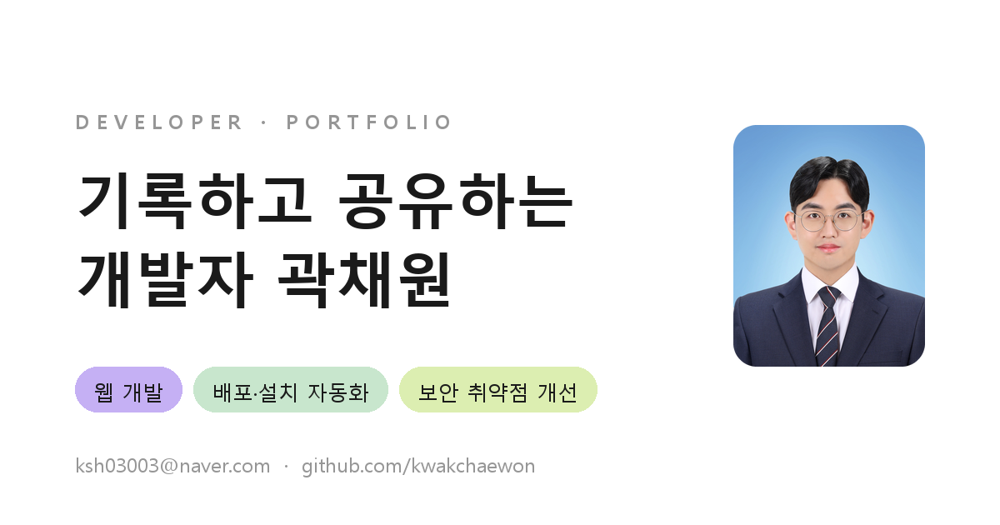

# 곽채원 · 포트폴리오

> 기록하고 공유하는 개발자 곽채원의 웹 포트폴리오입니다.

**🔗 Live — [kwakchaewon.github.io/chaewon_portfolio](https://kwakchaewon.github.io/chaewon_portfolio/)**



<br>

## 수록 내용

### Experience
| 기간 | 소속 | 역할 |
| --- | --- | --- |
| 2024.02 – 현재 | 이든티앤에스 기술연구소 | 백엔드 · 기술 지원 담당 |
| 2023 | KT AIVLE School | 수료 |
| 2019.08 – 2020.08 | 태화이노베이션 SI 3팀 | — |

### Projects
| # | 프로젝트 | 기간 | 요약 |
| --- | --- | --- | --- |
| 01 | 표준 Oracle 환경 대응 리팩토링 | 2024.04 – 2025.11 | MariaDB + MyBatis → JPA + QueryDSL 전환. Oracle 기준 DDL 재설계, 동적 쿼리 표준화, batch flush·clear 메모리 안정화로 DB 교체 시 수정 범위 축소 |
| 02 | RPM · Inno Setup 기반 설치 패키지 표준화 | 2025.01 – 2025.04<br>2026.06 – 2026.08 | [Windows] Inno Setup 7 단일 .exe로 설치·업데이트·IP/포트 변경·언인스톨 라이프사이클 전 구간 관리(PowerShell · NSSM 서비스 등록), [Linux] rpmbuild 기반 8개 OS 대상 설치 자동화. 설치·장애 대응 비용 90% 이상 절감, 배포 용량 53% 최적화(1,893MB → 887MB) |
| 03 | 행정안전부 기준 보안 취약점 대응 | 2025.08 – 2025.12 | 「주요정보통신기반시설 기술적 취약점 분석·평가 방법(2021)」 기준으로 Web · WAS · DB · OS 4개 계층 점검 및 조치 |

### Claude 기반 AX 업무 전환
> 프롬프트 의존에서 구조적 통제로 전환했습니다.

| # | 영역 | 주요 성과 | 요약 |
| --- | --- | --- | --- |
| 01 | Claude Code · 스킬 기반 표준 개발 사이클 | 개발 컨벤션 준수율 향상 · 토큰 사용량 절감 | 플랜 → 승인 → 작은 변경 → 검증 게이트 사이클 정립, auto-commit · create-pr · write-release-note 스킬 직접 구현, 3회 이상 반복 작업은 스킬로 추출 |
| 02 | Claude Design · 표준 UI 기준과 디자인 일관성 | 사내 표준 디자인 시스템 구축 | 사내 표준 UI 기준 수립, 토큰 · 컴포넌트 · 패턴 3계층 설계, 토큰 외 값 하드코딩 금지 PR 룰로 일관성 유지 |
| 03 | Notion MCP · 자연어 한 줄로 표준 개발 문서 | Notion MCP 문서 파이프라인 구축 | 노션 개발 문서 템플릿 표준 정의, 자연어 요청을 템플릿대로 자동 작성, 작성된 문서 · 보고를 노션 DB에 이력화 |
| 04 | openKB · 문서를 위키로 컴파일하는 NoRAG 챗봇 | 문서 1,252건 지식화 · 재청킹 일치율 98.4% | Qdrant 역추적으로 유실 원본 .md 52개 무손실 복원, LLM 없는 결정론적 전처리 도구 개발, 골든셋 A/B · LLM-as-Judge 평가 |

### Side Project
**[QuSign](https://qusign.link)** — 양자 컴퓨터에도 안전한 암호(PQC)로 만든 전자서명 SaaS. AWS 기반 운영형 인프라를 비용·보안·모니터링까지 직접 구성했습니다.

<br>

## 기술 스택

| 분류 | 사용 기술 |
| --- | --- |
| Language | Java, Kotlin, Python, Shell |
| Backend | Spring Boot, Django, Vue |
| Infra | Docker, Jenkins, RPM, Apache, AWS, Redis |
| Tool | Claude Design, Claude Security, Notion, Git |

**Certification** · 정보처리기사 · SQLD · AWS Solutions Architect – Associate · 컴퓨터활용능력 1급

<br>

## 저장소 구조

```
.
├── index.html              # 포트폴리오 단일 페이지 (에셋이 인라인 번들된 빌드 산출물)
├── assets/                 # OG 이미지 · 파비콘
├── docs/
│   └── 곽채원 · 포트폴리오.pdf   # PDF 버전
├── robots.txt
└── sitemap.xml
```

`index.html`은 이미지·폰트가 base64로 포함된 단일 파일 번들입니다. 페이지 로드 시 번들 로더가 에셋을 Blob URL로 풀어 렌더링하므로 별도 빌드나 의존성 설치가 필요 없습니다.

<br>

## 로컬에서 보기

파일을 직접 열어도 되지만, 상대 경로 에셋(파비콘·OG 이미지)까지 확인하려면 로컬 서버를 권장합니다.

```bash
python -m http.server 8000
# http://localhost:8000
```

<br>

## 배포

`main` 브랜치 루트를 GitHub Pages가 그대로 서빙합니다. `index.html`을 수정해 push하면 자동 반영됩니다.

<br>

## 연락처

- 📧 ksh03003@naver.com
- 🐙 [github.com/kwakchaewon](https://github.com/kwakchaewon)
